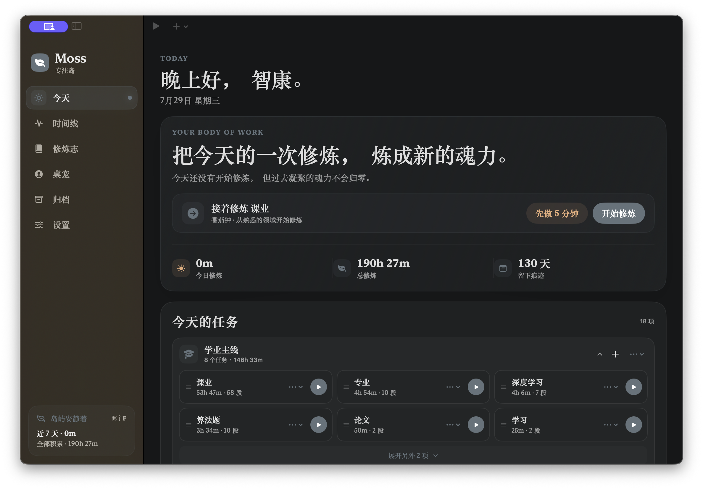
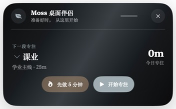
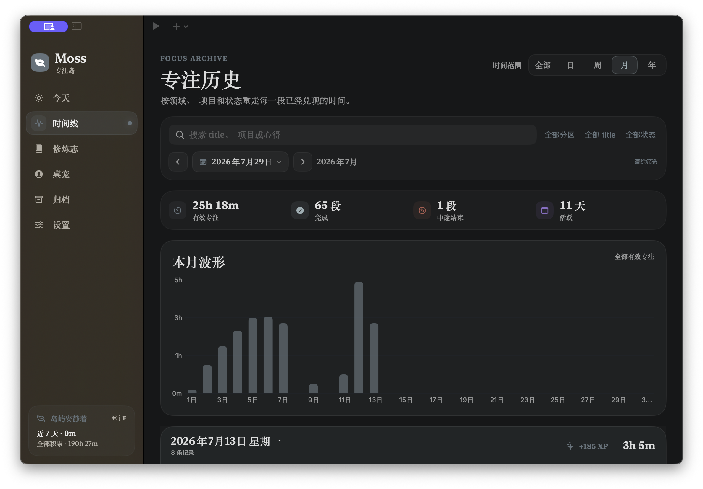

# Moss · 专注岛

一款本地优先、低打扰的原生 macOS 专注工具。它不只倒数 25 分钟，更在意记录是否真实、开始是否轻松，以及时间最终积累成了什么。



## 它和普通番茄钟有什么不同

- **先进入状态，再开始计时**：默认提供 1 分钟暖身，这段时间不计入有效专注。
- **不让误触污染记录**：开始后过早结束会自动丢弃，暖身和丢弃阈值都能按任务调整。
- **五分钟点火**：状态不好时不必承诺完整番茄钟，先做 5 分钟再说。
- **每个任务有自己的节奏**：番茄钟、倒计时、正计时和无限计时可以分别设置。
- **离开电脑也不丢时间**：重启、合盖或休眠后按真实经过时间恢复，不靠后台空转猜测。
- **记录打断，也记录回来**：可以标记分心、返回原任务，并在结束时补充完成情况和心得。

## 关键功能

- 刘海专注岛、菜单栏控制与可拖动桌面小组件；
- 项目 / 任务管理，快速开始上一次任务；
- 日、周、月、年时间线与可交互专注波形；
- 年度热力图、累计时间、连续天数与成长里程碑；
- 成长主题、桌宠、自定义背景和多套配色；
- 本地 JSON / CSV 导出，归档可恢复；
- 可选的 iCloud 私有数据库同步；默认关闭，不需要 Moss 账户。

### 桌面小组件

桌面小组件停在桌面层，不遮挡普通应用窗口。可以直接选任务、先做 5 分钟、开始、暂停、继续或结束。

<p align="center">
  
</p>

### 专注历史

按项目、任务、状态和时间范围回看真实投入；悬停柱形可以查看当天的准确时长。



## 下载

前往 [Gitee Releases](https://gitee.com/Limkimer/moss/releases) 或
[GitHub Releases](https://github.com/Arlic-Festoken/moss-focus-island/releases/latest)：

- `.dmg`：打开后把 `Moss.app` 拖入“应用程序”；
- `.zip`：解压后直接获得应用；
- `SHA256SUMS.txt`：校验下载文件。

支持 Apple Silicon 与 Intel Mac，要求 macOS 14 或更高版本。安装包采用本地签名，尚未经过 Apple 公证；首次打开若被系统拦截，请在 Finder 中右键应用并选择“打开”。

## 数据与隐私

Moss 始终先把数据保存在：

```text
~/Library/Application Support/Moss/moss-data.json
```

设置中启用 iCloud 后，项目、任务、专注记录、计划和手记会同步到当前
Apple ID 的 CloudKit 私有数据库。关闭同步不会删除本机文件。开发与签名配置见
[iCloud 同步说明](docs/icloud-sync.md)。

快捷键：

- `⌘ ⇧ F`：开始上一次任务；
- `⌘ ⇧ P`：暂停 / 继续；
- `⌘ ⇧ E`：结束并进入记录。

## 构建

```bash
./scripts/verify-all.sh
./scripts/build-app.sh
open dist/Moss.app
```

普通构建采用本地签名，iCloud 保持不可用。连接真实 CloudKit 容器需要 Apple
Development 签名：

```bash
MOSS_ENABLE_ICLOUD_ENTITLEMENTS=1 \
MOSS_SIGN_IDENTITY="Apple Development: Your Name (TEAMID)" \
./scripts/build-app.sh
```

发布下一版本：

```bash
./scripts/release.sh 1.4.0
```

## License

[MIT](LICENSE)
