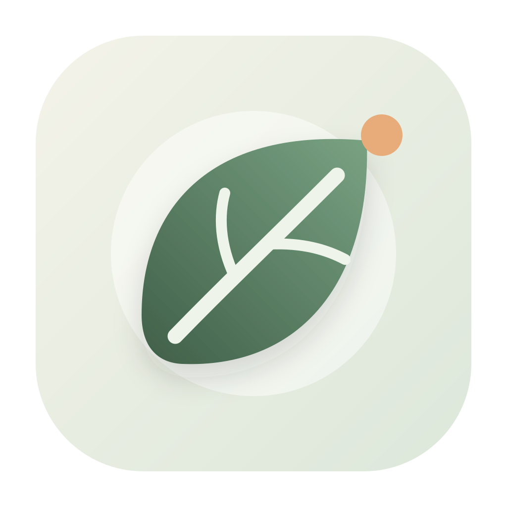
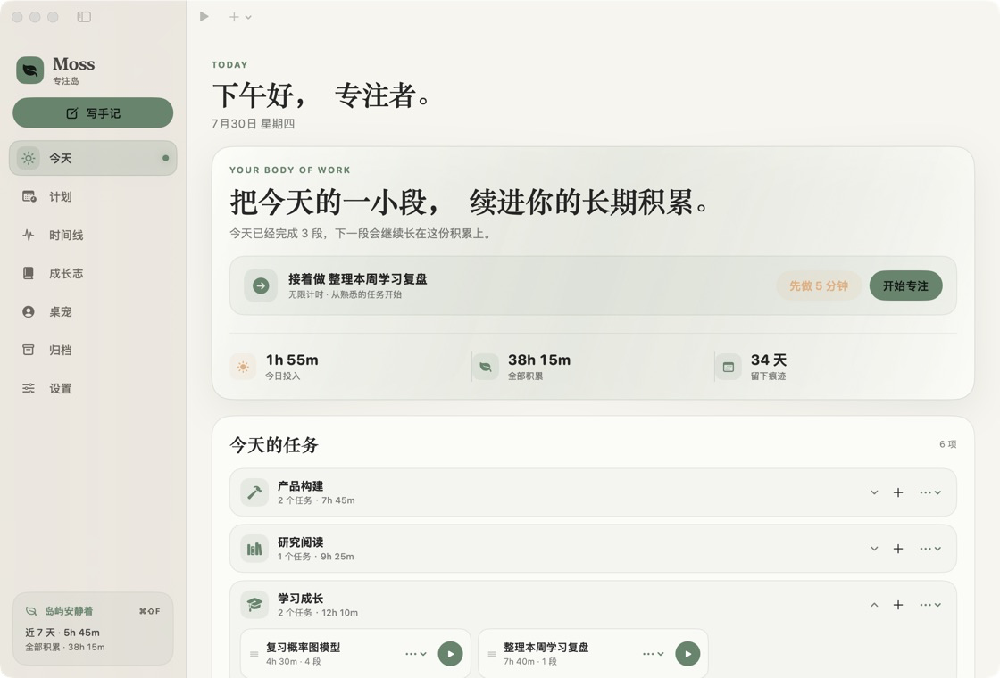
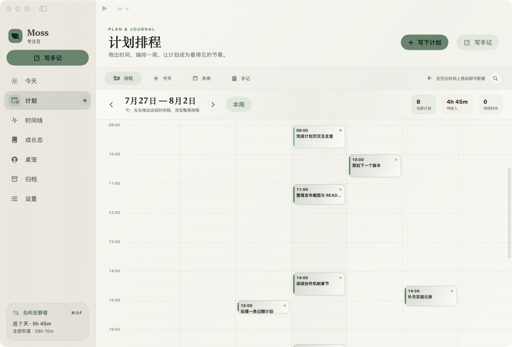
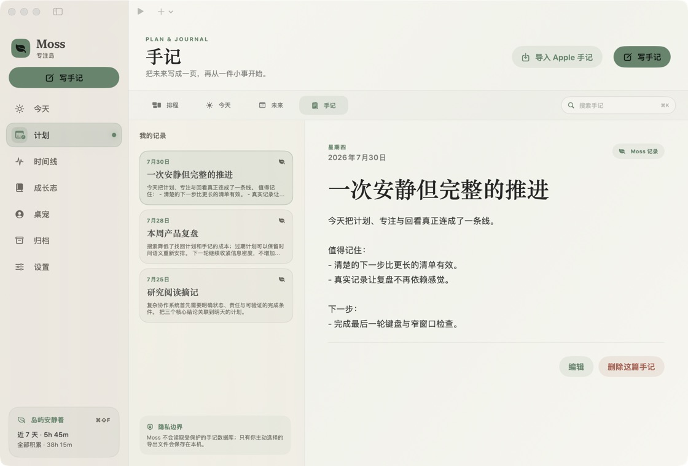
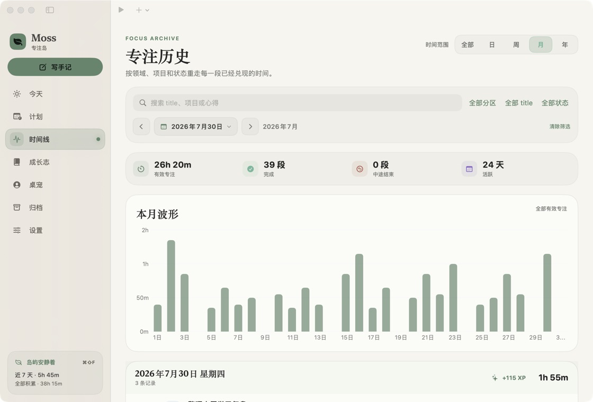
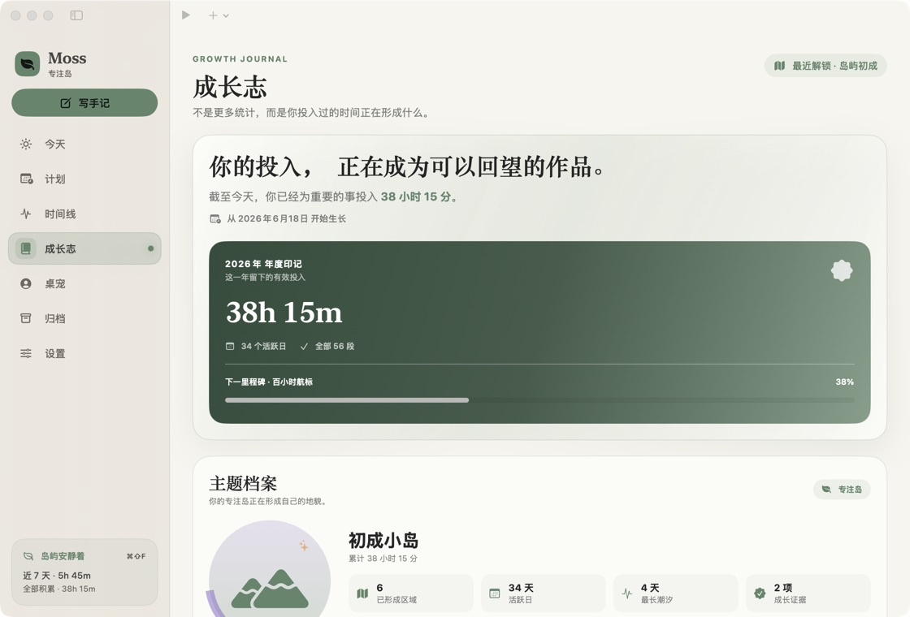

<p align="center">
  
</p>

<h1 align="center">Moss · 专注岛</h1>

<p align="center">
  一款本地优先、低打扰的原生 macOS 专注工具。<br>
  把计划、计时、真实记录与长期回看连接成一条安静的工作流。
</p>

<p align="center">
  <a href="https://github.com/Arlic-Festoken/moss-focus-island/actions/workflows/ci.yml">
    
  </a>
  <a href="https://github.com/Arlic-Festoken/moss-focus-island/releases/latest">
    
  </a>
  
  
  <a href="LICENSE">
    
  </a>
</p>

<p align="center">
  <a href="https://github.com/Arlic-Festoken/moss-focus-island/releases/latest"><strong>下载最新版</strong></a>
  ·
  <a href="https://gitee.com/Limkimer/moss/releases">Gitee 镜像</a>
  ·
  <a href="#从源码构建">从源码构建</a>
</p>



> 截图使用独立生成的匿名演示数据，不包含真实任务、手记或个人信息。

## 为什么是 Moss

普通番茄钟只关心倒计时是否结束。Moss 更在意三个问题：

- **能否轻松开始**：完整番茄钟太重时，可以先做 5 分钟；正式计时前还可设置暖身阶段。
- **记录是否真实**：过早结束不会污染统计；休眠、合盖和重启后按真实经过时间恢复。
- **时间最终形成了什么**：计划、专注历史、手记、热力图与成长里程碑共享同一份事实。

Moss 不要求账号，也不依赖在线服务。数据默认保存在本机；需要多设备同步时，可以主动启用 Apple ID 对应的 CloudKit 私有数据库。

## 一条完整的专注闭环

```text
写下计划 → 安排时间 → 先做 5 分钟 / 开始专注 → 记录结果 → 回看时间线 → 收束成手记
```

### 计划与手记

<table>
  <tr>
    <td width="50%">
      
    </td>
    <td width="50%">
      
    </td>
  </tr>
  <tr>
    <td valign="top">
      <strong>安静的周排程</strong><br>
      在周视图中拖出时间盒，新建、移动或调整计划；逾期项目可以温和地移到今天或明天，并保留原来的时刻与预计用时。
    </td>
    <td valign="top">
      <strong>计划之后，留下手记</strong><br>
      搜索 Moss 手记或主动导入 Apple 手记导出文件；“收束今天”会根据当天的计划与专注事实生成一份可编辑、不会自动保存的草稿。
    </td>
  </tr>
</table>

统一搜索支持计划标题、说明、关联任务，以及手记标题和正文。按 `⌘ K` 聚焦搜索，按 `Esc` 清空。

### 时间线与长期成长

<table>
  <tr>
    <td width="50%">
      
    </td>
    <td width="50%">
      
    </td>
  </tr>
  <tr>
    <td valign="top">
      <strong>重走每一段真实投入</strong><br>
      按日、周、月或年查看专注波形，并使用项目、任务、状态和全文条件筛选。每一段记录都保留实际时长与完成状态。
    </td>
    <td valign="top">
      <strong>让时间形成可以回望的作品</strong><br>
      年度热力图、活跃天数、连续记录、领域地形和成长证据共同表达长期积累，而不把专注简化成一个分数。
    </td>
  </tr>
</table>

## 功能概览

| 领域 | 能力 |
| --- | --- |
| 专注计时 | 番茄钟、倒计时、正计时、无限计时、暖身阶段、五分钟点火、暂停与恢复 |
| 任务管理 | 项目与任务、任务级计时策略、预计专注段数、快速开始上一次任务 |
| 计划排程 | 周时间盒、拖拽创建与移动、今日 / 未来书架、逾期重排、关联专注任务 |
| 手记 | Moss 原生手记、Apple 手记导入、全文搜索、今日收束草稿 |
| 真实记录 | 中断与返回、过早结束丢弃、完成状态、心得、休眠与重启恢复 |
| 回顾分析 | 日 / 周 / 月 / 年时间线、专注波形、年度热力图、连续天数、成长里程碑 |
| macOS 体验 | 刘海专注岛、菜单栏控制、桌面小组件、状态驱动桌面伙伴、全局快捷键、浅色与深色外观 |
| 数据能力 | 本地 JSON 数据库、JSON / CSV 导出、可恢复归档、可选 iCloud 私有同步 |

### 原生桌面入口

Moss 的专注岛、菜单栏和桌面小组件提供同一套轻量控制面：选任务、先做 5 分钟、开始、暂停、继续或结束，不必反复切回主窗口。

<p align="center">
  
</p>

原创桌面伙伴使用 SwiftUI 代码绘制，不依赖第三方角色素材。它会跟随准备、专注、暂停、休息和复盘切换姿态，并提供安静 / 活泼节奏、尺寸、显示层级、全屏自动收起、位置锁定与重置；默认停在桌面层，不遮挡普通窗口。

## 设计原则

- **Local-first**：本机文件是第一数据源；iCloud 同步默认关闭。
- **Truth over streaks**：不把误触、暖身或无效时长包装成完成记录。
- **Calm by default**：低饱和配色、纸页层级与克制动效，避免用高密度面板制造压力。
- **Human in the loop**：草稿、计划重排与导入均由用户确认，不静默替用户修改内容。
- **Native macOS**：SwiftUI、菜单栏、全局快捷键、窗口恢复与系统外观保持一致。

## 安装

前往 [GitHub Releases](https://github.com/Arlic-Festoken/moss-focus-island/releases/latest) 或 [Gitee Releases](https://gitee.com/Limkimer/moss/releases)：

- `.dmg`：打开后将 `Moss.app` 拖入“应用程序”；
- `.zip`：解压后直接获得通用版应用；
- `SHA256SUMS.txt`：用于校验下载文件完整性。

支持 Apple Silicon 与 Intel Mac，最低要求为 macOS 14。当前安装包采用本地签名，尚未经过 Apple 公证；首次打开若被系统拦截，请在 Finder 中右键应用并选择“打开”。

## 数据与隐私

Moss 默认将全部数据保存在：

```text
~/Library/Application Support/Moss/moss-data.json
```

设置中启用 iCloud 后，项目、任务、专注记录、计划和手记会同步到当前 Apple ID 的 CloudKit 私有数据库。关闭同步不会删除本机文件，也不会创建 Moss 账户。

更多实现和签名信息见 [iCloud 同步说明](docs/icloud-sync.md)。

## 快捷键

| 快捷键 | 操作 |
| --- | --- |
| `⌘ ⇧ F` | 开始上一次任务 |
| `⌘ ⇧ P` | 暂停 / 继续 |
| `⌘ ⇧ E` | 结束当前专注 |
| `⌘ J` | 写一篇手记 |
| `⌘ K` | 搜索计划或手记 |
| `Esc` | 清空计划 / 手记搜索 |

## 从源码构建

### 环境

- macOS 14+
- 能够提供 Swift 6.2 工具链的 Xcode

### 验证与构建

```bash
git clone https://github.com/Arlic-Festoken/moss-focus-island.git
cd moss-focus-island

./scripts/verify-all.sh
./scripts/build-app.sh
open dist/Moss.app
```

`verify-all.sh` 会执行类型检查、行为检查和 UI 结构回归；CI 还会构建并验证 `arm64 + x86_64` 通用应用。

普通构建采用本地签名，iCloud 保持不可用。连接真实 CloudKit 容器需要 Apple Development 签名：

```bash
MOSS_ENABLE_ICLOUD_ENTITLEMENTS=1 \
MOSS_SIGN_IDENTITY="Apple Development: Your Name (TEAMID)" \
./scripts/build-app.sh
```

发布新版本：

```bash
./scripts/release.sh 1.4.0
```

脚本会校验版本与工作区状态、运行完整检查、创建签名提交和标签，并由 GitHub Actions 构建通用 `.zip`、`.dmg` 与校验文件。

## 项目结构

```text
Sources/Moss/       SwiftUI 应用、数据模型、计时与 CloudKit 同步
Tests/              可执行行为检查
Resources/          Info.plist、图标与签名权限
scripts/            验证、构建、打包与发布脚本
docs/               同步说明、设计规格与产品截图
.github/workflows/  CI 与 Release 自动化
```

## 参与开发

欢迎通过 [Issues](https://github.com/Arlic-Festoken/moss-focus-island/issues) 报告问题或提出建议。提交 Pull Request 前请先运行：

```bash
./scripts/verify-all.sh
```

## License

Moss 使用 [MIT License](LICENSE)。
